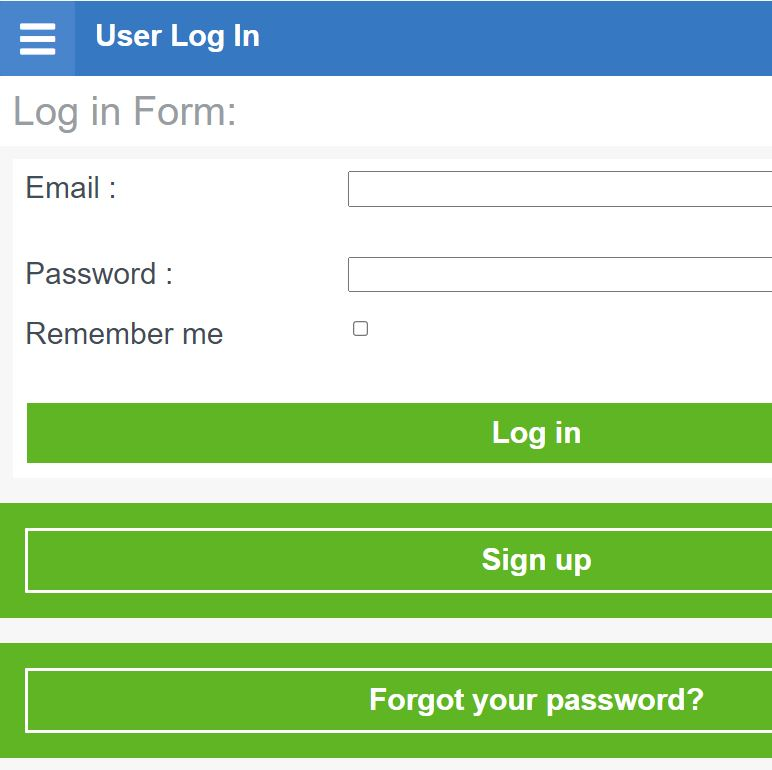

# WorkHours 

This project aims to provide an application that allows people that work in the same organization in different groups, to keep track of their work activity. 

A user can add the workhours that he has done to the group of activities, and can create new groups.

All users can see the monthly report of all projects and all workhours put into each group.



## Built With

- Ruby v2.7.0
- Ruby on Rails v5.2.4

## Live Demo

[Live Demo](https://project-workhours.herokuapp.com/users/sign_in)


## Getting Started

To get a local copy up and running follow these simple example steps.

### Prerequisites

Ruby: 2.6.3
Rails: 5.2.3
Postgres: >=9.5

### Setup

Instal gems with:

```
bundle install
```

Make sure to have yarn installed in your system:

`npm install --global yarn`

and run yarn with 

`yarn run`


Setup database with:

```
   rails db:create
   rails db:migrate
```

### Github Actions

To make sure the linters' checks using Github Actions work properly, you should follow the next steps:

1. On your recently forked repo, enable the GitHub Actions in the Actions tab.
2. Create the `feature/branch` and push.
3. Start working on your milestone as usual.
4. Open a PR from the `feature/branch` when your work is done.


### Usage

Start server with:

```
    rails server
```

Open `http://localhost:3000/` in your browser.

### Run tests

```
    rpsec --format documentation
```


## Authors :bust_in_silhouette:
### Ayman Jabr
\_[Github: @AymanJabr](https://github.com/AymanJabr/)
\_[LinkedIn: @Ayman Jabr](https://www.linkedin.com/in/ayman-jabr/)  

## Show your support

Give a ⭐️ if you like this project!

## Acknowledgments

Design by Gregoire Vella: https://www.behance.net/gallery/19759151/Snapscan-iOs-design-and-branding?tracking_source=& 

## 📝 License

### Creative Commons License

Design by Gregoire Vella: https://www.behance.net/gallery/19759151/Snapscan-iOs-design-and-branding?tracking_source=&   

You are free to:
Share — copy and redistribute the material in any medium or format
Adapt — remix, transform, and build upon the material
for any purpose, even commercially.
This license is acceptable for Free Cultural Works.
The licensor cannot revoke these freedoms as long as you follow the license terms.
Under the following terms:
Attribution — You must give appropriate credit, provide a link to the license, and indicate if changes were made. You may do so in any reasonable manner, but not in any way that suggests the licensor endorses you or your use.

No additional restrictions — You may not apply legal terms or technological measures that legally restrict others from doing anything the license permits.
Notices:
You do not have to comply with the license for elements of the material in the public domain or where your use is permitted by an applicable exception or limitation.
No warranties are given. The license may not give you all of the permissions necessary for your intended use. For example, other rights such as publicity, privacy, or moral rights may limit how you use the material.
